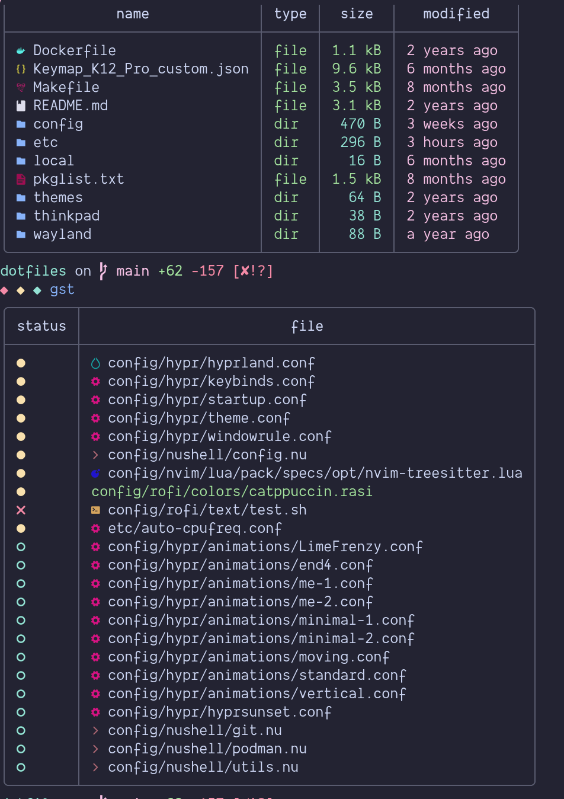
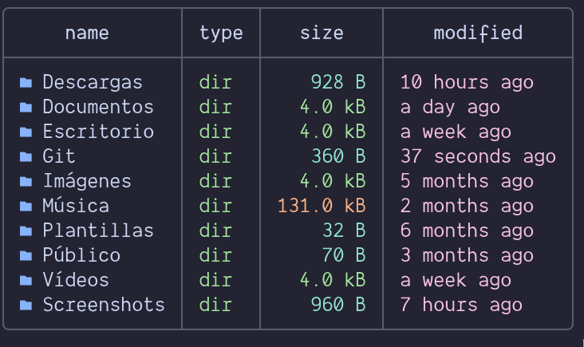
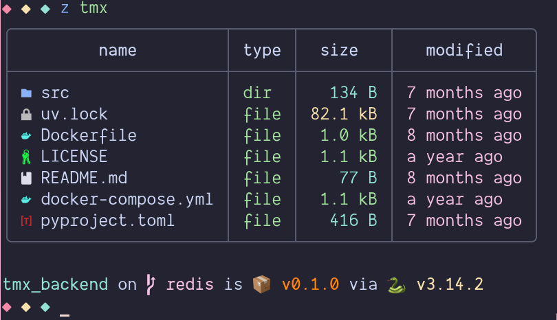

# Nushell ls Icons

`nu_ls_icons` is a Nushell script that enhances the standard `ls` command by adding custom icons and colors to file and directory names. This provides a more visually informative and aesthetically pleasing terminal experience.

## Features

- **Iconic Representation:** Easily distinguish between different file types and directories at a glance.
- **Customizable Colors:** Apply custom foreground colors to icons based on file type or directory name.
- **Nushell Integration:** Seamlessly integrates with your existing Nushell environment.

## Installation

### Prerequisites

- [Nushell](https://www.nushell.sh/)
- [Yazi theme](https://github.com/sxyazi/yazi/blob/main/yazi-config/preset/theme-dark.toml)
- [Nerd Fonts](https://www.nerdfonts.com/)

### Steps

1.  **Save the Script:**
    Save the `lsi.nu` file to a convenient location, for example, `~/.config/nushell/lsi.nu`.

    ```bash
    curl -fsSL https://raw.githubusercontent.com/CRAG666/nu_ls_icons/main/lsi.nu | save ~/.config/nushell/lsi.nu
    ```

2.  **Source the Script:**
    Add the following line to your Nushell configuration file (`config.nu`, usually located at `~/.config/nushell/config.nu`) to source the script:

    ```nushell
    $env.LSI_THEME_PATH = "~/.config/yazi/theme.toml"
    source ~/.config/nushell/lsi.nu
    ```

## Usage

Once installed, simply use the `ls` command as you normally would. The output will now include icons and custom colors for files and directories based on your theme configuration.

```bash
ls -la
```

aditionally you can use the `gst` command for git status.

```bash
gst
```

## Screenshots

Here are some examples of `nu_ls_icons` in action:






## Contributing

**Pull requests are welcome!** If you have improvements, bug fixes, or new features, feel free to submit a PR directly instead of opening an issue. This helps move things forward faster.

If you're not sure about something, you can still open a discussion or issue, but PRs are preferred.
